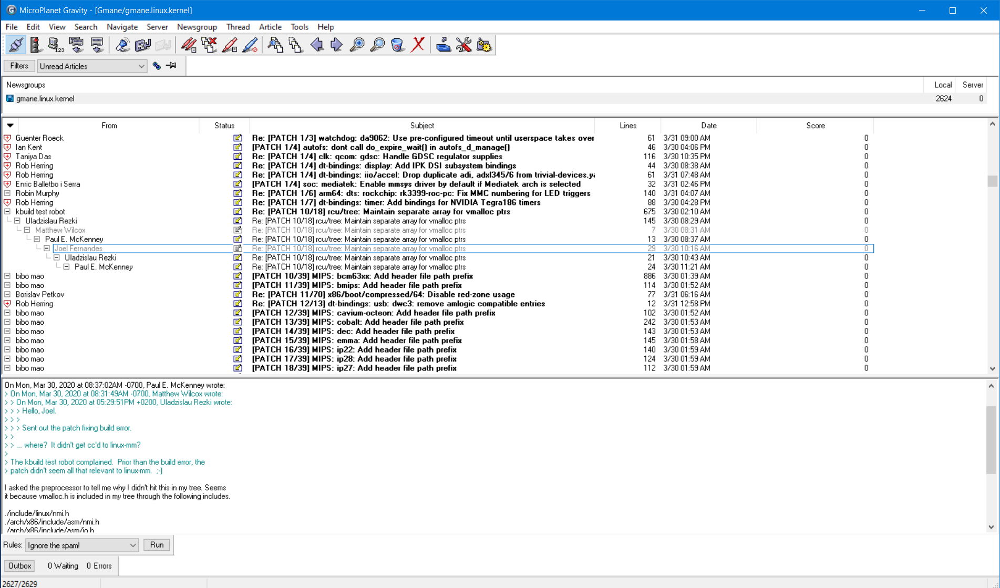

# MicroPlanet Gravity

This is MicroPlanet Gravity, an opensource news reader for Microsoft Windows.
The previous maintainer has not updated the code for over 10 years, but I still
use it when I'm on Windows to read mailing lists on [gmane](http://gmane.io/).

I've decided to adopt it and make new releases.



I've updated the code to compile with Visual Studio 2019, fixed a few bugs and
crashes, and added a few features I've wanted. I've also modified it to build
with GNU make and WiX my preferred build and install systems.

https://sourceforge.net/projects/mpgravity/

# Installer

Just want an installer? [Click Here!](https://github.com/taviso/mpgravity/releases)


# Build Instructions

I use GNU make, you can install it from [here](http://gnuwin32.sourceforge.net/packages/make.htm).

If you want to build the installer, you also need the [WiX toolset](https://wixtoolset.org/).

Open a "Developer Command Prompt", navigate to the directory where you checked
out these sources, and type make.


```
C:\..\mpgravity> make
```

As far as I know, you only need `MSVC`, `MFC` and the `SDK` components of
Visual Studio.


# Changes

>  The latest version is 3.0.5


```

3.0.6 UNRELEASED
  [+] Added : Experimental support for NNTPS, you can select
      "Connect Securely" in the server dialog.
  [+] Changed : Disable the splashscreen by default.
  [+] Changed : Use startup directory to find help file, which makes
      portable installation easier.

3.0.5 Released 07/04/2020
  [+] Upgraded : Gravity now builds with VS2019.
  [+] Added : Mouse scroll wheel now works in subscription dialog.
  [+] Added : New rule syntax "Cross-posted to alt.terrible.group".
  [-] Fixed : Dialog titles could sometimes contain garbage or crash.
  [+] Upgraded: zlib 1.2.3 (from 2005) to 1.2.11 (from 2017).
  [+] Upgraded: pcre 4.4 (from 2003!) to 8.8 (from 2020).
  [+] Upgraded: hunspell 1.2.8 (from 2008) to 1.7.0 (from 2018).
  [+] Upgraded: libpng 1.2.8 (from 2004) to 1.6.37 (from 2019).
  [+] Upgraded: Updated the affix and dictionaries from libreoffice.
  [+] Fixed : Spellchecker no longer uses HKLM to lookup dictionary
      path, this doesn't make sense post-Vista. It now always uses
      the folder that the Gravity executable is in.
  [+] Upgraded: Installer now builds with WiX.
```

# Binary

Please check the releases tab if you want an installer.

# Notes

Please create a new issue if there are any bugs.

I'll also consider implementing feature requests.

# Security

I will fix any security bugs you report, you can either create an issue or email me at <taviso@gmail.com>.
