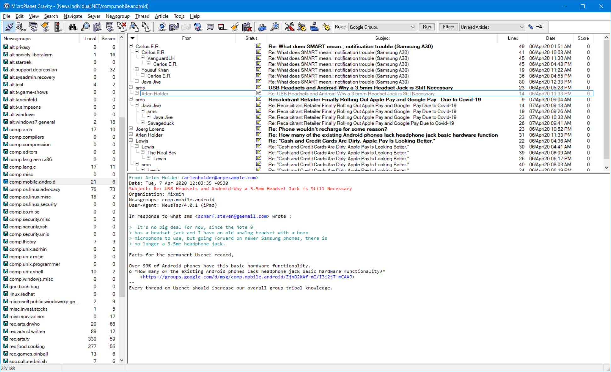

# MicroPlanet Gravity

This is just an import of MicroPlanet Gravity 3.0.4, updated to compile with
Visual Studio 2019. I also modified it to build with GNU make, my preferred
build system.

I use an NNTP reader to read mailing lists on [gmane](http://gmane.io/), but
don't have a good one for when I'm on Windows. There are a few popular ones,
but this one is opensource and relatively full featured (but somewhat dated).




# Build Instructions

I use GNU make, you can install it from [here](http://gnuwin32.sourceforge.net/packages/make.htm).

Open a "Developer Command Prompt", navigate to the directory where you checked
out these sources, and type make.


```
C:\..\mpgravity\src> make
```

As far as I know, you only need `MSVC`, `MFC` and the `SDK` components of
Visual Studio.

# Notes

I need to update some of the dependencies 😬

# Binary

Please check the releases tab if you want a binary.

